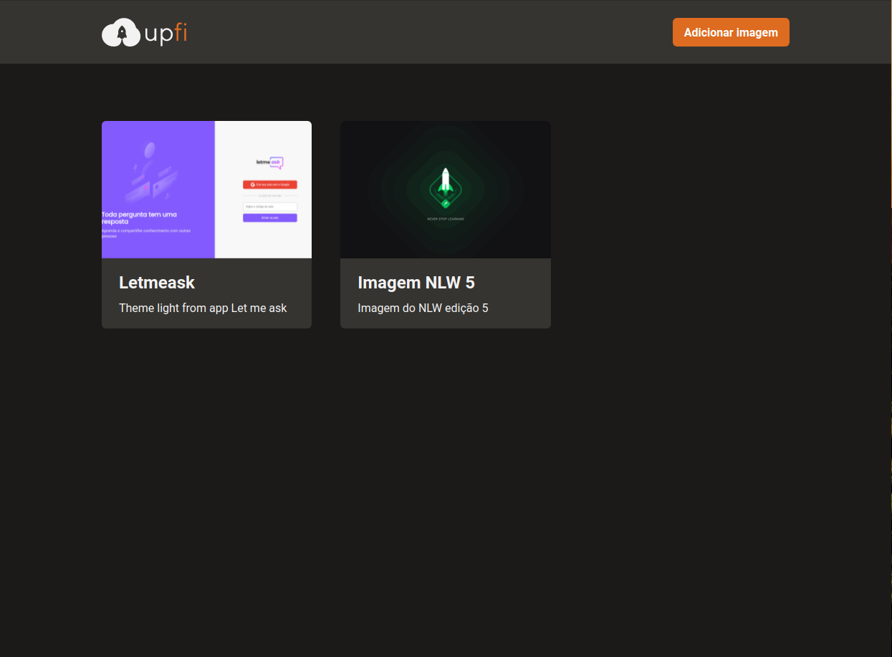

<p align="center">
  
</p>

<p align="center">
  

  

  
</p>

<h1 align="center">
  
</h1>

<br>

## 🧪 Tecnologias

Este projeto foi desenvolvido durante o curso Ignite da trilha de ReactJS da [Rocketseat](https://rocketseat.com.br).

A aplicação desenvolvida utiliza as seguintes tecnologias:

- [Next.js](https://nextjs.org)
- [TypeScript](https://www.typescriptlang.org)
- [React Query](https://react-query.tanstack.com)
- [React Hook Form](https://react-hook-form.com)
- [ImgBB](https://imgbb.com)
- [FaunaDB](https://fauna.com)
- [Chakra UI](https://chakra-ui.com)
- [Figma](https://www.figma.com)

## 🚀 Como executar

Antes de começar, você vai precisar ter instalado em sua máquina as seguintes ferramentas:
[Git](https://git-scm.com), [Node.js](https://nodejs.org/en/).
Além disto é bom ter um editor de sua preferência para trabalhar com o código como por exemplo o [VSCode](https://code.visualstudio.com/).

```bash
$ git clone https://github.com/alexandresantosm/challenge-reactjs-upload-de-imagens
$ cd challenge-reactjs-upload-de-imagens
```

Para iniciar o projeto, siga os passos abaixo:

```bash
# Instalar as dependências necessárias do projeto
$ yarn # ou
$ npm install

# Execute a aplicação em modo de desenvolvimento
$ yarn dev # ou
$ npm dev
```

O app estará disponível no seu browser pelo endereço http://localhost:3000.

## 🔖 Requisitos prévios

- Lembrando que será necessário ter uma conta no [ImgBB](https://imgbb.com).

  - Crie uma chave API.
  - Copiar a chave e colar no arquivo `.env.local` da seguinte forma: <span style="color:#DD6B20">NEXT_PUBLIC_IMGBB_API_KEY=VALOR_DA_CHAVE_COPIADA</span>.

- Será necessário ter, também, uma conta no [FaunaDB](https://fauna.com):
  - Crie um banco no FaunaDB com um nome de sua preferência.
  - O banco precisa ter uma coleção chamada <span style="color:#DD6B20">images</span>.
  - Criar e copiar a chave do banco no arquivo `.env.local` da seguinte forma: <span style="color:#DD6B20">FAUNA_API_KEY=VALOR_DA_CHAVE_COPIADA</span>.

## 💻 Projeto

Upfi é uma aplicação onde o principal objetivo é fazer o upload de imagens.

Ela realiza requisições para a própria API Next.js e retorna dados do faunaDB (banco de dados schema free) e do ImgBB (um serviço de hospedagem de imagens).

## ✅ Demonstração da aplicação

<br>

<video width="900" height="450" controls>
  <source alt="Vídeo demonstrativo do Upfi" src=".github/upfi-video.mp4" />
</video>

<br><br>

## 🔖 Layout

Você pode visualizar o layout do projeto, disponibilizado pela [Rocketseat](https://rocketseat.com.br), através do link abaixo:

- [Layout Upfi no Figma](https://www.figma.com/file/QKxbxCVwwlDLMrCtHae239/Desafio-2-M%C3%B3dulo-4-ReactJS/duplicate?node-id=0%3A1)

Lembrando que você precisa ter uma conta no [Figma](http://figma.com/).

## 📝 License

Esse projeto está sob a licença MIT. Veja o arquivo [LICENSE](LICENSE.md) para mais detalhes.

---

Feito com 💜 by Alexandre 👋🏻
